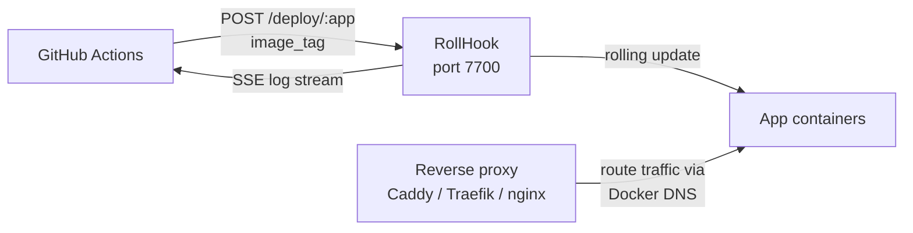

# RollHook

**Zero-downtime rolling Docker Compose deployments via webhooks.**

[](https://www.npmjs.com/package/rollhook)
[](https://registry.jkrumm.com)
[](LICENSE)

---

## What it is

RollHook receives a webhook from your CI pipeline, pulls the new image, and rolls it
out across your Docker Compose service — one container at a time, waiting for each
healthcheck to pass before proceeding.

No config file. Integrate in one CI step. No dashboard, no provisioning, no vendor.

### Scope

RollHook handles rolling deployments. It does not:

- Build or push images (that's your CI — GitHub Actions, Docker Buildx)
- Manage DNS, TLS, or routing (that's your reverse proxy — Caddy, Traefik, nginx)
- Provision or configure servers
- Replace a full PaaS if you need multi-tenant ops

A deployment monitoring dashboard and multi-VPS support are on the roadmap.

---

## Architecture



Your reverse proxy routes traffic to app containers via Docker's internal DNS — the service name resolves to all active containers automatically. During a rollout, old and new containers coexist briefly; the proxy load-balances between them until the old one is removed. RollHook orchestrates the deployment sequence and reports results.

---

## Infra Setup

RollHook runs alongside your existing reverse proxy — Caddy, Traefik, nginx, or any other. No proxy-specific configuration is required. Reference infra configurations are in [`examples/infra/`](examples/infra/):

| File                | Purpose                                           |
| ------------------- | ------------------------------------------------- |
| `compose.infra.yml` | Traefik + Alloy + RollHook reference stack        |
| `config.alloy`      | Alloy reference config for log/metrics collection |

---

## Quick Start

### 1. Run RollHook

The recommended setup uses a [socket proxy](https://github.com/Tecnativa/docker-socket-proxy) to limit Docker socket exposure. RollHook communicates with Docker via `DOCKER_HOST=tcp://socket-proxy:2375` instead of a direct socket mount — no host path dependency, no distro-specific plugin paths.

```yaml
# docker-compose.yml (on your VPS)
services:
  socket-proxy:
    image: tecnativa/docker-socket-proxy:latest
    restart: unless-stopped
    environment:
      CONTAINERS: 1
      SERVICES: 1
      IMAGES: 1
      INFO: 1
      POST: 1 # required: RollHook issues write operations (scale, pull)
    volumes:
      - /var/run/docker.sock:/var/run/docker.sock:ro
    networks:
      - socket-proxy-net

  rollhook:
    image: registry.jkrumm.com/rollhook:latest
    restart: unless-stopped
    depends_on:
      - socket-proxy
    environment:
      ADMIN_TOKEN: ${ADMIN_TOKEN}
      WEBHOOK_TOKEN: ${WEBHOOK_TOKEN}
      DOCKER_HOST: tcp://socket-proxy:2375
      # Optional: Pushover mobile notifications
      # PUSHOVER_USER_KEY: ${PUSHOVER_USER_KEY}
      # PUSHOVER_APP_TOKEN: ${PUSHOVER_APP_TOKEN}
    volumes:
      - rollhook-data:/app/data
      # Mount each app's compose directory at the same absolute path it has on the host.
      # RollHook discovers the path from Docker Compose labels and reads the file
      # from inside the container — the paths must match exactly.
      # - /srv/stacks/my-api:/srv/stacks/my-api:ro
    networks:
      - socket-proxy-net
      - proxy # your reverse proxy network

networks:
  socket-proxy-net:
    internal: true # isolated — only rollhook can reach socket-proxy
  proxy:
    external: true

volumes:
  rollhook-data:
```

> **Minimal alternative:** replace the socket proxy with a direct socket mount and remove the `socket-proxy` service and `socket-proxy-net` network. Simpler, but gives RollHook full Docker socket access. See [Security](#security) for the threat model.
>
> ```yaml
> volumes:
>   - /var/run/docker.sock:/var/run/docker.sock
> ```

### 2. Ensure your app is running at least once

RollHook discovers the compose file and service automatically from the running container's Docker Compose labels — no server-side config file needed. This means the container must already exist before the first deploy.

```bash
# First-time setup: start your service manually (or via your normal deploy process)
docker compose -f /srv/stacks/my-api/compose.yml up -d
```

Two things are required in your `compose.yml`:

1. **`image: ${IMAGE_TAG:-...}`** — RollHook finds the running container by matching the image name you send in the webhook. RollHook passes `IMAGE_TAG` as an inline environment variable when invoking `docker rollout`.
2. **A `healthcheck:`** — `docker rollout` gates each swap on the new container passing its healthcheck.

See the [compose.yml requirements](#composeyml-requirements) section below for the full spec.

> **Compose file access:** RollHook runs `docker rollout` inside the container, which reads the compose file from the container filesystem. Mount each app's compose directory as a read-only bind mount at the same path it has on the host:
>
> ```yaml
> volumes:
>   - /srv/stacks/my-api:/srv/stacks/my-api:ro
> ```

### 3. Trigger a deploy

```bash
curl -X POST https://your-vps:7700/deploy/my-api \
  -H "Authorization: Bearer $WEBHOOK_TOKEN" \
  -H "Content-Type: application/json" \
  -d '{"image_tag": "ghcr.io/you/my-api:abc123"}'

# → blocks until complete
# → {"job_id": "...", "app": "my-api", "status": "success"}
# → HTTP 500 + error field on failure
```

Add `?async=true` to return immediately with `"status": "queued"` instead.

Stream logs (webhook or admin token):

```bash
curl -N https://your-vps:7700/jobs/<job_id>/logs \
  -H "Authorization: Bearer $WEBHOOK_TOKEN"
```

---

## `compose.yml` requirements

For zero-downtime deployments to work correctly, each service must satisfy:

1. **No `ports:` mapping** — your reverse proxy routes traffic via Docker's internal DNS; `ports:` prevents scaling to multiple instances
2. **No `container_name:`** — fixed names prevent the scaler from creating a second instance
3. **A `healthcheck:`** — the deployment waits for the new instance to be healthy before removing the old one
4. **On the same Docker network as your proxy** — so the proxy can reach the service by its DNS name (e.g. `backend:3000`)

Minimal example:

```yaml
services:
  backend:
    image: ${IMAGE_TAG:-registry.example.com/my-api:latest}
    healthcheck:
      test: [CMD, curl, -f, http://localhost:3000/health]
      interval: 5s
      timeout: 5s
      start_period: 10s
      retries: 5
    networks:
      - proxy

networks:
  proxy:
    external: true
```

**How zero-downtime works without proxy config changes:** Docker's embedded DNS resolves the service name (`backend`) to all active containers in that service. During a rollout, old and new containers coexist — your proxy load-balances between them automatically. Once the old container is removed, only the new one remains. No dynamic discovery or label-watching required.

**Traefik users:** Add [active health check labels](https://doc.traefik.io/traefik/routing/services/#health-check) so Traefik stops routing to the draining container immediately rather than waiting on passive checks. See [`examples/infra/`](examples/infra/) for a reference stack.

**Image tag pattern:** use `${IMAGE_TAG:-registry.example.com/my-api:latest}` in `compose.yml`. RollHook passes `IMAGE_TAG=<full-uri>` as an inline environment variable when invoking `docker rollout` — no `.env` file is written or required.

---

## Graceful shutdown (required for zero-downtime)

Your application **must** handle `SIGTERM` gracefully to avoid 502 errors during the container swap. Without this, the load balancer may route requests to an instance that has already stopped accepting connections.

The pattern:

1. On `SIGTERM`: return `503` from your health endpoint — the load balancer stops routing new requests
2. Wait briefly for the load balancer to deregister (2–3 seconds covers the health check polling interval)
3. Finish in-flight requests, then exit

**Example (Bun):**

```ts
import process from 'node:process'

let isShuttingDown = false

const server = Bun.serve({
  port: Number(process.env.PORT ?? 3000),
  fetch(req) {
    const { pathname } = new URL(req.url)
    if (pathname === '/health')
      return new Response(isShuttingDown ? 'shutting down' : 'ok', { status: isShuttingDown ? 503 : 200 })
    // ... your routes
  },
})

process.on('SIGTERM', async () => {
  isShuttingDown = true
  // Give Traefik time to deregister this instance (healthcheck interval + buffer)
  await new Promise(resolve => setTimeout(resolve, 3000))
  await server.stop(true) // drain in-flight requests
  process.exit(0)
})
```

**Example (Node/Express):**

```ts
import process from 'node:process'
import express from 'express'

let isShuttingDown = false
const app = express()

app.get('/health', (_, res) => {
  res.status(isShuttingDown ? 503 : 200).send(isShuttingDown ? 'shutting down' : 'ok')
})

const server = app.listen(3000)

process.on('SIGTERM', () => {
  isShuttingDown = true
  setTimeout(() => {
    server.close(() => process.exit(0))
  }, 3000)
})
```

See [`examples/bun-hello-world/`](examples/bun-hello-world/) for a complete working reference.

---

## API

Interactive docs at `/openapi` (Scalar UI). Key routes:

| Method | Route            | Auth           | Description                                                                                                  |
| ------ | ---------------- | -------------- | ------------------------------------------------------------------------------------------------------------ |
| `POST` | `/deploy/:app`   | webhook, admin | Trigger rolling deployment                                                                                   |
| `GET`  | `/jobs/:id`      | webhook, admin | Job status + metadata (includes `compose_path`, `service`, `error`)                                          |
| `GET`  | `/jobs/:id/logs` | webhook, admin | SSE log stream                                                                                               |
| `GET`  | `/jobs`          | admin          | Paginated job history (`?app=&status=&limit=`)                                                               |
| `GET`  | `/health`        | none           | Returns `200 { "status": "ok", "version": "1.2.3" }` — suitable for Uptime Kuma, Traefik health checks, etc. |
| `GET`  | `/openapi`       | none           | Scalar API docs                                                                                              |

**Auth:** `Authorization: Bearer <token>` header.

- `WEBHOOK_TOKEN` — deploy endpoint only
- `ADMIN_TOKEN` — all endpoints

---

## Notifications

RollHook sends notifications on deployment completion (success or failure).

**Pushover** (mobile push): set environment variables on the server process:

```bash
PUSHOVER_USER_KEY=your-user-key
PUSHOVER_APP_TOKEN=your-app-token
```

**Webhook**: set `NOTIFICATION_WEBHOOK_URL` as an environment variable. RollHook POSTs the full job result JSON to that URL on completion.

Notification failures are written to the job log — they never affect job status.

---

## Environment Variables

| Variable                   | Required | Description                                                                                     |
| -------------------------- | -------- | ----------------------------------------------------------------------------------------------- |
| `ADMIN_TOKEN`              | yes      | Bearer token for admin API access                                                               |
| `WEBHOOK_TOKEN`            | yes      | Bearer token for deploy webhook calls                                                           |
| `DOCKER_HOST`              | no       | Docker daemon endpoint (e.g. `tcp://socket-proxy:2375`). Defaults to the local socket if unset. |
| `PORT`                     | no       | Port to listen on (default: `7700`)                                                             |
| `PUSHOVER_USER_KEY`        | no       | Pushover user key for mobile notifications                                                      |
| `PUSHOVER_APP_TOKEN`       | no       | Pushover app token for mobile notifications                                                     |
| `NOTIFICATION_WEBHOOK_URL` | no       | URL to POST the full job result JSON to on completion                                           |

---

## Security

### Threat model

When using a direct socket mount, RollHook has effective root access on the Docker host via `/var/run/docker.sock`. A compromised `WEBHOOK_TOKEN` means an attacker can trigger arbitrary deployments with any image tag — treat it with the same sensitivity as an SSH private key.

### Docker socket access

**Recommended: socket proxy**

Use [Tecnativa's docker-socket-proxy](https://github.com/Tecnativa/docker-socket-proxy) to restrict Docker API access to only the operations RollHook requires. Set `DOCKER_HOST=tcp://socket-proxy:2375` on RollHook and isolate the proxy on an internal network. Required permissions: `CONTAINERS=1 SERVICES=1 IMAGES=1 INFO=1 POST=1`.

This approach also eliminates the distro-specific CLI plugin path problem: with `DOCKER_HOST` set, RollHook uses the Docker CLI bundled in the image to connect over TCP — no host bind mounts for docker-compose or docker-rollout needed.

**Alternative: direct socket mount**

```yaml
volumes:
  - /var/run/docker.sock:/var/run/docker.sock
```

Simpler to configure but gives RollHook unrestricted Docker access. Acceptable for single-tenant VPS setups where the threat model is primarily external. The socket proxy is the better default for anything production-facing.

### Token generation

Generate strong tokens with:

```bash
openssl rand -hex 32
```

### HTTPS required

Never expose port 7700 directly to the internet. Always place RollHook behind a reverse proxy with TLS termination — Cloudflare Tunnel, Caddy, Traefik, or nginx. Plaintext HTTP exposes your bearer token on every request.

### Admin endpoint scope

`ADMIN_TOKEN` should never leave the server — it has full API access including job logs and registry mutation. If you run behind a reverse proxy, consider blocking `/jobs`, `/registry`, and `/openapi` from external networks and only exposing `/deploy` and `/health` to CI.

`WEBHOOK_TOKEN` is the only credential that needs to exist in CI secrets. It covers `POST /deploy/:app`, `GET /jobs/:id`, and `GET /jobs/:id/logs` — the full CI journey of trigger → poll → stream.

### Bun baseline image

The Docker image uses `oven/bun:1.3.9-slim` (the x86_64 baseline variant) intentionally. This ensures compatibility across older x86_64 hardware without AVX2. Modern CPUs incur no meaningful performance difference for this workload.

### Future

HMAC-SHA256 webhook signature verification (`X-Hub-Signature-256`) is planned as an optional hardening layer. This will let callers sign the exact payload with a shared secret, adding defense-in-depth against token-only leakage.

---

## Volume Mounts (when running in Docker)

| Path                   | Purpose                                                                                                                                                                                                           |
| ---------------------- | ----------------------------------------------------------------------------------------------------------------------------------------------------------------------------------------------------------------- |
| `/app/data`            | SQLite DB + job logs (persist across restarts)                                                                                                                                                                    |
| `/var/run/docker.sock` | Docker socket — only when using direct socket mount (not needed with `DOCKER_HOST`)                                                                                                                               |
| `/srv/stacks/my-app`   | App compose directory — one read-only bind mount per deployed app, at the same absolute path as on the host. RollHook discovers the path from Docker labels and reads the compose file from inside the container. |

---

## `rollhook` npm Package

The `rollhook` npm package exports shared TypeScript types for working with the RollHook API programmatically.

```ts
import type { JobResult, JobStatus } from 'rollhook'
// JobStatus: 'queued' | 'running' | 'success' | 'failed'
// JobResult: full job record shape returned by GET /jobs/:id
```

---

## GitHub Actions integration

Use the official [rollhook-action](https://github.com/jkrumm/rollhook-action) for real-time log streaming back to CI:

```yaml
- uses: jkrumm/rollhook-action@v1
  with:
    url: https://rollhook.example.com
    token: ${{ secrets.ROLLHOOK_WEBHOOK_TOKEN }}
    app: my-api                          # compose service name; defaults to repo name if they match
    image_tag: registry.example.com/my-api:${{ github.sha }}
```

The action POSTs the deploy trigger, then streams SSE logs live to the CI run and polls for the terminal state — no custom scripts needed.

**Inputs:** `url`, `token`, `app` (default: repo name — set explicitly when compose service name differs), `image_tag`, `timeout` (default: 600s)
**Outputs:** `job_id`, `status`

**Alternative — plain curl:**

```yaml
- name: Deploy
  run: |
    curl --fail-with-body -sS -X POST ${{ secrets.ROLLHOOK_URL }}/deploy/my-api \
      -H "Authorization: Bearer ${{ secrets.ROLLHOOK_WEBHOOK_TOKEN }}" \
      -H "Content-Type: application/json" \
      -d '{"image_tag": "${{ env.REGISTRY }}/my-api:${{ github.sha }}"}'
```

---

## Testing

### Commands

| Command                 | Description                                    |
| ----------------------- | ---------------------------------------------- |
| `bun run test`          | Unit tests (bun:test, no Docker required)      |
| `bun run test:coverage` | Unit tests with per-file coverage table        |
| `bun run test:e2e`      | E2E tests (requires Docker + `docker-rollout`) |
| `bun run validate`      | Full suite: lint + typecheck + unit + E2E      |

### Coverage scope

`bun run test:coverage` reports unit test coverage only. E2E tests run the server as a subprocess — server-side coverage during E2E is not collected. The two test layers serve complementary purposes:

- **Unit tests** — pure logic in isolation (auth middleware, config validation, queue, notifications)
- **E2E tests** — behavioral contracts against a live server with real Docker, Traefik, and `docker-rollout`

### Known gaps

The following scenarios are not covered by the current test suite. They are tracked here rather than as TODO comments in code.

| Area               | Gap                                                                               | Risk   |
| ------------------ | --------------------------------------------------------------------------------- | ------ |
| `steps/rollout.ts` | Multi-service rollouts (2+ steps) — only single-service tested via E2E            | Medium |
| `server.ts`        | Graceful SIGTERM: 503 response during shutdown, clean exit — code exists, no test | Low    |
| `api/jobs.ts`      | SSE stream abort mid-read, empty log file (404)                                   | Low    |
| `api/deploy.ts`    | Empty `image_tag` input (passes `t.String()` validation)                          | Low    |

---

## Roadmap

### MVP

- [x] Bearer auth (`ADMIN_TOKEN` + `WEBHOOK_TOKEN` env vars, two roles)
- [x] `POST /deploy/:app` — accepts `image_tag`, returns `job_id`
- [x] `GET /jobs/:id` — status + metadata
- [x] `GET /jobs/:id/logs` — SSE stream from `data/logs/<id>.log`
- [x] `GET /jobs` — paginated job history with app/status filters
- [x] Pre-deploy validation (`compose_path` existence check)
- [x] Stateless auto-discovery — finds compose file and service from running container's Docker Compose labels
- [x] Zero-downtime rolling deployment (scale → health-gate → remove old)
- [x] Pushover + configurable webhook notifications (`NOTIFICATION_WEBHOOK_URL`)
- [x] `rollhook` npm package (shared TypeScript types: `JobResult`, `JobStatus`)
- [x] Example app with correct compose, healthcheck, and graceful shutdown
- [x] Public Docker image: `registry.jkrumm.com/rollhook`
- [x] `examples/infra/` — reference `compose.infra.yml` (Traefik + RollHook + socket proxy)
- [x] `jkrumm/rollhook-action` — GitHub Action with real-time SSE log streaming to CI

### Post-MVP

- [ ] Ordered multi-service steps with dependency graph
- [ ] Rollback: `POST /deploy/:app/rollback` (redeploy last successful image)
- [ ] Multi-VPS support via Docker contexts
- [ ] Static site deployment (nginx + Traefik labels)
- [ ] Self-hosting guide + Hetzner quickstart
