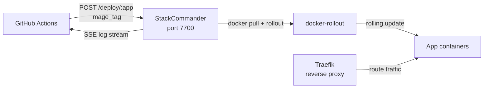

# StackCommander

**The opinionated, TypeScript-native rolling deployment server for Docker Compose on VPS.**

[](https://www.npmjs.com/package/stackcommander)
[](https://ghcr.io/jkrumm/stackcommander)
[](LICENSE)

---

## What it is

StackCommander is a self-hosted HTTP server that receives webhook calls from GitHub Actions, runs zero-downtime rolling deployments via `docker-rollout`, and streams logs back to CI.

It is **not** a PaaS, has no GUI, and does not manage clusters. It does one thing: take an image tag, roll it out across a Docker Compose service, and tell you if it worked.

**What it is NOT:**
- Not a replacement for Kubernetes or Nomad
- Not a full PaaS (no build system, no domain provisioning)
- Not a GUI dashboard (API-only, Scalar docs at `/openapi`)
- Not a multi-tenant platform (single-operator, self-hosted)

---

## Architecture



Traefik handles ingress and zero-downtime traffic shifting during rollouts. StackCommander orchestrates the deployment sequence and reports results.

---

## Infra Prerequisites

StackCommander requires Traefik and optionally Alloy running on the same host. These are **not** bundled — they belong in a separate infra stack.

Reference configurations are provided in [`examples/infra/`](examples/infra/):

| File | Purpose |
|-|-|
| `compose.infra.yml` | Traefik + Alloy + StackCommander reference stack |
| `config.alloy` | Alloy reference config for log/metrics collection |

---

## Quick Start

### 1. Run StackCommander

```yaml
# docker-compose.yml (on your VPS)
services:
  stackcommander:
    image: ghcr.io/jkrumm/stackcommander:latest
    ports:
      - "7700:7700"
    volumes:
      - ./stackcommander.config.yaml:/app/stackcommander.config.yaml:ro
      - ./data:/app/data
      - /var/run/docker.sock:/var/run/docker.sock
    environment:
      ADMIN_TOKEN: ${ADMIN_TOKEN}
      WEBHOOK_TOKEN: ${WEBHOOK_TOKEN}
```

### 2. Configure apps

```yaml
# stackcommander.config.yaml (on your VPS, gitignored)
# yaml-language-server: $schema=https://cdn.jsdelivr.net/npm/stackcommander/schema/config.json
apps:
  - name: my-api
    clone_path: /srv/apps/my-api
  - name: my-frontend
    clone_path: /srv/apps/my-frontend
notifications:
  pushover:
    user_key: ""
    app_token: ""
```

### 3. Add `stackcommander.yaml` to each app repo

```yaml
# stackcommander.yaml (in your app repo)
# yaml-language-server: $schema=https://cdn.jsdelivr.net/npm/stackcommander/schema/app.json
name: my-api
compose_file: compose.yml
steps:
  - service: backend
    wait_for_healthy: true
notifications:
  on_failure: true
  on_success: false
secrets:
  doppler_project: my-api
  doppler_config: production
```

### 4. Trigger a deploy

```bash
curl -X POST https://your-vps:7700/deploy/my-api \
  -H "Authorization: Bearer $WEBHOOK_TOKEN" \
  -H "Content-Type: application/json" \
  -d '{"image_tag": "ghcr.io/you/my-api:abc123"}'

# → {"job_id": "job_01JXYZ...", "app": "my-api", "status": "queued"}
```

Poll for status or stream logs:

```bash
# Stream logs (SSE)
curl -N https://your-vps:7700/jobs/job_01JXYZ.../logs \
  -H "Authorization: Bearer $ADMIN_TOKEN"
```

---

## `stackcommander.yaml` Reference

Per-app config file committed to each app repo. StackCommander reads this from `clone_path` at deploy time.

```yaml
# yaml-language-server: $schema=https://cdn.jsdelivr.net/npm/stackcommander/schema/app.json
name: my-api                       # required — must match registry key
compose_file: compose.yml          # default: compose.yml

steps:
  - service: backend               # required — Docker Compose service name
    wait_for_healthy: true         # default: true — gate next step on healthcheck
  - service: frontend
    wait_for_healthy: true
    after: backend                 # sequential dependency (waits for backend step)

notifications:
  on_failure: true                 # default: true
  on_success: false                # default: false

secrets:
  doppler_project: my-api         # Doppler project for `doppler run --`
  doppler_config: production      # Doppler config (environment)

# docker_context: default         # post-MVP: multi-VPS via Docker contexts
```

**Pre-deploy validation** checks before any deployment runs:
- `stackcommander.yaml` validates against JSON Schema
- Each service listed in `steps` has a `healthcheck` in `compose.yml`
- No `container_name` overrides (blocks rolling replacement)

---

## API

Interactive docs at `/openapi` (Scalar UI). Key routes:

| Method | Route | Auth | Description |
|-|-|-|-|
| `POST` | `/deploy/:app` | webhook, admin | Trigger rolling deployment |
| `GET` | `/jobs/:id` | admin | Job status + metadata |
| `GET` | `/jobs/:id/logs` | admin | SSE log stream |
| `GET` | `/jobs` | admin | Paginated job history (`?app=&status=&limit=`) |
| `GET` | `/registry` | admin | All registered apps + last deploy |
| `PATCH` | `/registry/:app` | admin | Update app config at runtime |
| `GET` | `/health` | none | Liveness check |
| `GET` | `/openapi` | none | Scalar API docs |

**Auth:** Bearer tokens via `Authorization: Bearer <token>` header.
- `WEBHOOK_TOKEN` — deploy endpoint only
- `ADMIN_TOKEN` — all endpoints

---

## `stackcommander` npm Package

Primarily a schema delivery mechanism — published to npm so JSON Schemas are served via jsDelivr CDN. Schemas are defined in TypeBox (already in the stack via Elysia), which produces valid JSON Schema natively. The server imports the same schemas directly for route validation — no conversion library, no duplication.

JSON Schema files are served via jsDelivr CDN:

| Schema | URL |
|-|-|
| `stackcommander.yaml` | `https://cdn.jsdelivr.net/npm/stackcommander/schema/app.json` |
| `stackcommander.config.yaml` | `https://cdn.jsdelivr.net/npm/stackcommander/schema/config.json` |

Add the `# yaml-language-server: $schema=...` comment at the top of each YAML file for IDE validation without any plugin config.

```ts
// Optional: programmatic validation in app tooling (TypeBox schemas = standard JSON Schema objects)
import { AppConfigSchema } from 'stackcommander'
import type { AppConfig } from 'stackcommander'
```

---

## Self-Hosting

```bash
docker pull ghcr.io/jkrumm/stackcommander:latest
```

### Environment Variables

| Variable | Required | Description |
|-|-|-|
| `ADMIN_TOKEN` | yes | Bearer token for admin API access |
| `WEBHOOK_TOKEN` | yes | Bearer token for `/deploy` webhook calls |
| `NODE_ENV` | no | Set to `production` for production mode |

### Volume Mounts

| Path | Purpose |
|-|-|
| `/app/stackcommander.config.yaml` | Server config (mount as read-only) |
| `/app/data` | SQLite DB + job logs (persist across restarts) |
| `/var/run/docker.sock` | Docker socket (required for `docker rollout`) |

### Minimal `stackcommander.config.yaml`

```yaml
# yaml-language-server: $schema=https://cdn.jsdelivr.net/npm/stackcommander/schema/config.json
apps:
  - name: my-app
    clone_path: /srv/apps/my-app
```

---

## Roadmap

### MVP

- [ ] Bearer auth (`ADMIN_TOKEN` + `WEBHOOK_TOKEN` env vars, two roles)
- [ ] `POST /deploy/:app` — accepts `image_tag`, returns `job_id`
- [ ] `GET /jobs/:id` — status + metadata
- [ ] `GET /jobs/:id/logs` — SSE stream from `data/logs/<id>.log`
- [ ] Pre-deploy validation (`stackcommander.yaml` schema + compose healthcheck + no `container_name`)
- [ ] Job executor: `docker pull` → `doppler run -- docker rollout` (sequential, healthcheck-gated)
- [ ] Ordered multi-service steps with `after:` dependency
- [ ] Pushover notifications (`on_failure: true` by default)
- [ ] `stackcommander.yaml` JSON Schema + SchemaStore submission
- [ ] `stackcommander` npm package (Zod schemas + TS types, JSON Schema via jsDelivr)
- [ ] `stackcommander.config.yaml` loading + validation
- [ ] Example app: Bun hello-world with `stackcommander.yaml` and healthcheck
- [ ] Public Docker image: `ghcr.io/jkrumm/stackcommander`
- [ ] `examples/infra/` — reference `compose.infra.yml` (Traefik + Alloy + StackCommander) + `config.alloy`

### Post-MVP

- [ ] Multi-VPS support via Docker contexts (`docker_context` in `stackcommander.yaml`)
- [ ] `GET /jobs` — paginated job history with app/status filters
- [ ] `PATCH /registry/:app` — update app config at runtime
- [ ] Rollback: `POST /deploy/:app/rollback` (redeploy last successful job's image)
- [ ] Static site deployment (nginx + Traefik labels, CI-built image)
- [ ] Configurable notification webhooks (beyond Pushover)
- [ ] SchemaStore.org submission for IDE auto-detection
- [ ] Astro marketing site + hosted Scalar API docs
- [ ] Self-hosting guide + Hetzner quickstart

### Future

- [ ] Official GitHub Action (configure `WEBHOOK_URL` + `WEBHOOK_TOKEN`, done)
- [ ] E2E test: deploy sample app, simulate healthcheck failure, assert no container swap
- [ ] Single executable (`bun --compile`, minimal Docker footprint)
- [ ] Secrets rotation trigger: `POST /deploy/:app/refresh-secrets`
- [ ] Multi-tenant: multiple teams/orgs per StackCommander instance
