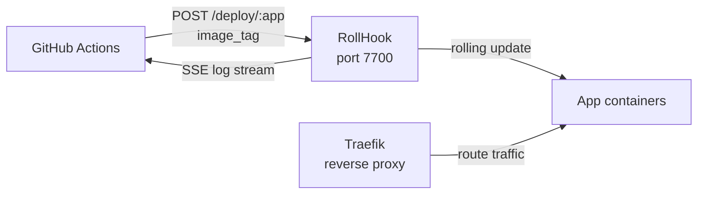

# RollHook

**The opinionated, TypeScript-native rolling deployment server for Docker Compose on VPS.**

[](https://www.npmjs.com/package/rollhook)
[](https://ghcr.io/jkrumm/rollhook)
[](LICENSE)

---

## What it is

RollHook is a self-hosted HTTP server that receives webhook calls from GitHub Actions, runs zero-downtime rolling deployments on your VPS, and streams logs back to CI.

It is **not** a PaaS, has no GUI, and does not manage clusters. It does one thing: take an image tag, roll it out across a Docker Compose service with zero downtime, and tell you if it worked.

**What it is NOT:**

- Not a replacement for Kubernetes or Nomad
- Not a full PaaS (no build system, no domain provisioning)
- Not a GUI dashboard (API-only, Scalar docs at `/openapi`)
- Not a multi-tenant platform (single-operator, self-hosted)

---

## Architecture



Traefik handles ingress and zero-downtime traffic shifting during rollouts. RollHook orchestrates the deployment sequence and reports results.

---

## Infra Prerequisites

RollHook requires Traefik running on the same host. Reference configurations are in [`examples/infra/`](examples/infra/):

| File                | Purpose                                           |
| ------------------- | ------------------------------------------------- |
| `compose.infra.yml` | Traefik + Alloy + RollHook reference stack        |
| `config.alloy`      | Alloy reference config for log/metrics collection |

---

## Quick Start

### 1. Run RollHook

```yaml
# docker-compose.yml (on your VPS)
services:
  rollhook:
    image: ghcr.io/jkrumm/rollhook:latest
    ports:
      - '7700:7700'
    volumes:
      - ./rollhook.config.yaml:/app/rollhook.config.yaml:ro
      - ./data:/app/data
      - /var/run/docker.sock:/var/run/docker.sock
    environment:
      ADMIN_TOKEN: ${ADMIN_TOKEN}
      WEBHOOK_TOKEN: ${WEBHOOK_TOKEN}
      # Optional: Pushover mobile notifications
      # PUSHOVER_USER_KEY: ${PUSHOVER_USER_KEY}
      # PUSHOVER_APP_TOKEN: ${PUSHOVER_APP_TOKEN}
```

### 2. Configure apps

```yaml
# rollhook.config.yaml (on your VPS, gitignored)
# yaml-language-server: $schema=https://cdn.jsdelivr.net/npm/rollhook/schema/config.json
apps:
  - name: my-api
    compose_path: /srv/stacks/my-api/compose.yml
    steps:
      - service: backend
  - name: my-frontend
    compose_path: /srv/stacks/my-frontend/compose.yml
    steps:
      - service: frontend

notifications:
  webhook: https://hooks.example.com/deployments # optional
```

### 3. Configure your `compose.yml` for zero-downtime deployments

See the [compose.yml requirements](#composeyml-requirements) section below.

### 4. Trigger a deploy

```bash
curl -X POST https://your-vps:7700/deploy/my-api \
  -H "Authorization: Bearer $WEBHOOK_TOKEN" \
  -H "Content-Type: application/json" \
  -d '{"image_tag": "ghcr.io/you/my-api:abc123"}'

# → {"job_id": "...", "app": "my-api", "status": "queued"}
```

Stream logs:

```bash
curl -N https://your-vps:7700/jobs/<job_id>/logs \
  -H "Authorization: Bearer $ADMIN_TOKEN"
```

---

## `compose.yml` requirements

For zero-downtime deployments to work correctly, each service must satisfy:

1. **No `ports:` mapping** — use a reverse proxy for traffic routing; `ports:` prevents scaling to multiple instances
2. **No `container_name:`** — fixed names prevent the scaler from creating a second instance
3. **A `healthcheck:`** — the deployment waits for the new instance to be healthy before removing the old one
4. **Traefik health check labels** — so Traefik only routes traffic to healthy instances (prevents 502s during the container swap window)

Minimal example:

```yaml
services:
  backend:
    image: ${IMAGE_TAG:-registry.example.com/my-api:latest}
    healthcheck:
      test: [CMD, curl, -f, http://localhost:3000/health]
      interval: 5s
      timeout: 5s
      start_period: 10s
      retries: 5
    labels:
      - traefik.enable=true
      - traefik.http.routers.backend.rule=Host(`api.example.com`)
      - traefik.http.routers.backend.entrypoints=websecure
      - traefik.http.services.backend.loadbalancer.server.port=3000
      # Active health check — Traefik only routes to instances that pass
      - traefik.http.services.backend.loadbalancer.healthcheck.path=/health
      - traefik.http.services.backend.loadbalancer.healthcheck.interval=2s
      - traefik.http.services.backend.loadbalancer.healthcheck.timeout=1s
    networks:
      - traefik

networks:
  traefik:
    external: true
```

**Image tag pattern:** use `${IMAGE_TAG:-registry.example.com/my-api:latest}` in `compose.yml`. RollHook passes `IMAGE_TAG=<full-uri>` as an inline environment variable when invoking `docker rollout` — no `.env` file is written or required.

---

## Graceful shutdown (required for zero-downtime)

Your application **must** handle `SIGTERM` gracefully to avoid 502 errors during the container swap. Without this, the load balancer may route requests to an instance that has already stopped accepting connections.

The pattern:

1. On `SIGTERM`: return `503` from your health endpoint — the load balancer stops routing new requests
2. Wait briefly for the load balancer to deregister (2–3 seconds covers the health check polling interval)
3. Finish in-flight requests, then exit

**Example (Bun):**

```ts
import process from 'node:process'

let isShuttingDown = false

const server = Bun.serve({
  port: Number(process.env.PORT ?? 3000),
  fetch(req) {
    const { pathname } = new URL(req.url)
    if (pathname === '/health')
      return new Response(isShuttingDown ? 'shutting down' : 'ok', { status: isShuttingDown ? 503 : 200 })
    // ... your routes
  },
})

process.on('SIGTERM', async () => {
  isShuttingDown = true
  // Give Traefik time to deregister this instance (healthcheck interval + buffer)
  await new Promise(resolve => setTimeout(resolve, 3000))
  await server.stop(true) // drain in-flight requests
  process.exit(0)
})
```

**Example (Node/Express):**

```ts
import process from 'node:process'
import express from 'express'

let isShuttingDown = false
const app = express()

app.get('/health', (_, res) => {
  res.status(isShuttingDown ? 503 : 200).send(isShuttingDown ? 'shutting down' : 'ok')
})

const server = app.listen(3000)

process.on('SIGTERM', () => {
  isShuttingDown = true
  setTimeout(() => {
    server.close(() => process.exit(0))
  }, 3000)
})
```

See [`examples/bun-hello-world/`](examples/bun-hello-world/) for a complete working reference.

---

## API

Interactive docs at `/openapi` (Scalar UI). Key routes:

| Method  | Route            | Auth           | Description                                    |
| ------- | ---------------- | -------------- | ---------------------------------------------- |
| `POST`  | `/deploy/:app`   | webhook, admin | Trigger rolling deployment                     |
| `GET`   | `/jobs/:id`      | admin          | Job status + metadata                          |
| `GET`   | `/jobs/:id/logs` | admin          | SSE log stream                                 |
| `GET`   | `/jobs`          | admin          | Paginated job history (`?app=&status=&limit=`) |
| `GET`   | `/registry`      | admin          | All registered apps + last deploy              |
| `PATCH` | `/registry/:app` | admin          | Update app config at runtime                   |
| `GET`   | `/health`        | none           | Liveness check                                 |
| `GET`   | `/openapi`       | none           | Scalar API docs                                |

**Auth:** `Authorization: Bearer <token>` header.

- `WEBHOOK_TOKEN` — deploy endpoint only
- `ADMIN_TOKEN` — all endpoints

---

## Notifications

RollHook sends notifications on deployment completion (success or failure).

**Pushover** (mobile push): set environment variables on the server process:

```bash
PUSHOVER_USER_KEY=your-user-key
PUSHOVER_APP_TOKEN=your-app-token
```

**Webhook**: set `notifications.webhook` in `rollhook.config.yaml`. RollHook POSTs the full job result JSON to that URL on completion.

Notification failures are written to the job log — they never affect job status.

---

## Environment Variables

| Variable               | Required | Description                                                           |
| ---------------------- | -------- | --------------------------------------------------------------------- |
| `ADMIN_TOKEN`          | yes      | Bearer token for admin API access                                     |
| `WEBHOOK_TOKEN`        | yes      | Bearer token for deploy webhook calls                                 |
| `ROLLHOOK_CONFIG_PATH` | no       | Absolute path to config file (default: `rollhook.config.yaml` in CWD) |
| `PUSHOVER_USER_KEY`    | no       | Pushover user key for mobile notifications                            |
| `PUSHOVER_APP_TOKEN`   | no       | Pushover app token for mobile notifications                           |

---

## Volume Mounts (when running in Docker)

| Path                        | Purpose                                            |
| --------------------------- | -------------------------------------------------- |
| `/app/rollhook.config.yaml` | Server config (mount as read-only)                 |
| `/app/data`                 | SQLite DB + job logs (persist across restarts)     |
| `/var/run/docker.sock`      | Docker socket (required for deployment operations) |

---

## `rollhook` npm Package

The `rollhook` npm package is primarily a schema delivery mechanism — schemas are served via jsDelivr CDN for YAML editor validation.

| Schema                 | URL                                                        |
| ---------------------- | ---------------------------------------------------------- |
| `rollhook.config.yaml` | `https://cdn.jsdelivr.net/npm/rollhook/schema/config.json` |

Add the `# yaml-language-server: $schema=...` comment at the top of your config file for IDE validation.

```ts
// Optional: programmatic validation in your tooling
import type { ServerConfig } from 'rollhook'
import { ServerConfigSchema } from 'rollhook'
```

---

## GitHub Actions integration

```yaml
- name: Deploy
  run: |
    curl -sf -X POST ${{ secrets.ROLLHOOK_URL }}/deploy/my-api \
      -H "Authorization: Bearer ${{ secrets.WEBHOOK_TOKEN }}" \
      -H "Content-Type: application/json" \
      -d '{"image_tag": "${{ env.REGISTRY }}/my-api:${{ github.sha }}"}'
```

---

## Testing

### Commands

| Command                 | Description                                    |
| ----------------------- | ---------------------------------------------- |
| `bun run test`          | Unit tests (bun:test, no Docker required)      |
| `bun run test:coverage` | Unit tests with per-file coverage table        |
| `bun run test:e2e`      | E2E tests (requires Docker + `docker-rollout`) |
| `bun run validate`      | Full suite: lint + typecheck + unit + E2E      |

### Coverage scope

`bun run test:coverage` reports unit test coverage only. E2E tests run the server as a subprocess — server-side coverage during E2E is not collected. The two test layers serve complementary purposes:

- **Unit tests** — pure logic in isolation (auth middleware, config validation, queue, notifications)
- **E2E tests** — behavioral contracts against a live server with real Docker, Traefik, and `docker-rollout`

### Known gaps

The following scenarios are not covered by the current test suite. They are tracked here rather than as TODO comments in code.

| Area               | Gap                                                                                       | Risk   |
| ------------------ | ----------------------------------------------------------------------------------------- | ------ |
| `steps/rollout.ts` | Multi-service rollouts (2+ steps) — only single-service tested via E2E                    | Medium |
| `config/loader.ts` | File-not-found and invalid YAML error paths — hard to unit test due to module-level cache | Medium |
| `server.ts`        | Graceful SIGTERM: 503 response during shutdown, clean exit — code exists, no test         | Low    |
| `api/jobs.ts`      | SSE stream abort mid-read, empty log file (404)                                           | Low    |
| `api/deploy.ts`    | Empty `image_tag` input (passes `t.String()` validation)                                  | Low    |

---

## Roadmap

### MVP

- [x] Bearer auth (`ADMIN_TOKEN` + `WEBHOOK_TOKEN` env vars, two roles)
- [x] `POST /deploy/:app` — accepts `image_tag`, returns `job_id`
- [x] `GET /jobs/:id` — status + metadata
- [x] `GET /jobs/:id/logs` — SSE stream from `data/logs/<id>.log`
- [x] `GET /jobs` — paginated job history with app/status filters
- [x] Pre-deploy validation (`compose_path` existence check)
- [x] Zero-downtime rolling deployment (scale → health-gate → remove old)
- [x] Pushover + configurable webhook notifications
- [x] `rollhook` npm package (TypeBox schemas + TS types, JSON Schema via jsDelivr CDN)
- [x] `rollhook.config.yaml` loading + validation
- [x] Example app with correct compose, healthcheck, and graceful shutdown
- [ ] Public Docker image: `ghcr.io/jkrumm/rollhook`
- [ ] `examples/infra/` — reference `compose.infra.yml` (Traefik + Alloy + RollHook)

### Post-MVP

- [ ] `PATCH /registry/:app` — persist config changes to `rollhook.config.yaml` (currently in-memory only)
- [ ] Ordered multi-service steps with dependency graph
- [ ] Rollback: `POST /deploy/:app/rollback` (redeploy last successful image)
- [ ] Multi-VPS support via Docker contexts
- [ ] Static site deployment (nginx + Traefik labels)
- [ ] Self-hosting guide + Hetzner quickstart
